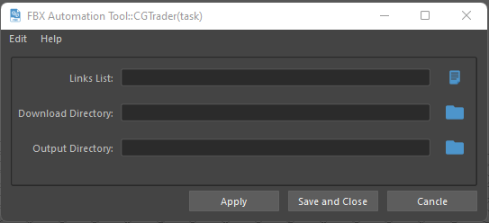

CGTrader pipeline automation tools.
FBX automation tool

## Features 

* Download files from server.
* Automatic link textures with fbx file base on configured texture names patterns.
* Frees Transformation of fbx objects
* Organize the output of fbx directory
* Supports Maya 2018+

## Tutorials

* [How to use the tool]()

## Installation

1. Download and unzip the *FBX_automation.zip* file from [github](https://github.com/Michaelredaa/fbx_automation/releases/tag/fbx).

2. Drag and drop the "FBX_automation/install.mel" file onto the Maya viewport.

3. Click the FBX_automation icon on the shelf to run.

Tip: If you would like use this tool with multiple users then
place the unzipped "FBX_automation" folder on a network drive.

## Requirements
- `requests` python module
`"C:\Program Files\Autodesk\Maya2022\bin\mayapy.exe" -m pip install requests`
- python 3 to run `localhost` server

## Documentation
1. Browse to choose the text file with all urls

2. Browse to choose the download and target directories.

3. Press Apply.

4. The output FBX file now is linked with textures.

5. If you want to use `localhost` server place "FBX_automation\example_files\server\start_server.bat" in your directory and run it

## Feedback and suggestions
email: eng.michaelreda@gmail.com
Mobile: +20 109 995 7208
